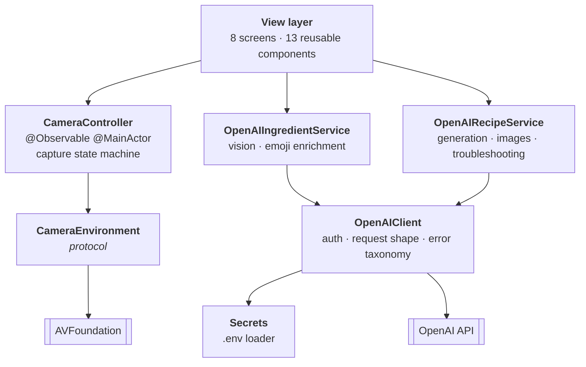
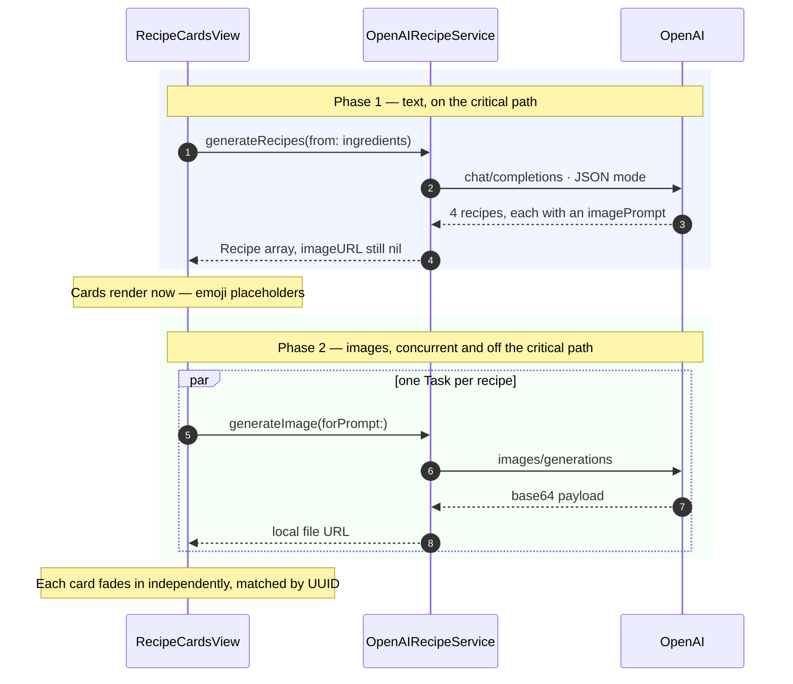

# Architecture

Technical notes on how SousAI is put together. For what the app does and how to run it, see [README.md](README.md).

**35 Swift files · ~7,150 lines of app code · 867 lines of tests · zero third-party dependencies.**

## Layers

Four layers, each depending only on the one beneath it. No coordinators, no global mutable stores, no dependency-injection framework.



Four of the five model call paths speak the same dialect, so the auth header, request body, status-code branching, decoding, and error mapping live in exactly one place. The two domain services above it own only their prompts and their decoding into domain types — small enough to read in a sitting, and a view never has to distinguish a transport failure from a 401.

## Navigation

The entire post-Home flow is a single `Hashable` enum, with each screen's payload riding as an associated value:

```swift
enum AppRoute: Hashable {
    case camera
    case confirmation(CapturedPhoto)
    case analyzing(CapturedPhoto)
    case ingredients(CapturedPhoto, [DetectedIngredient])
    case generatingRecipes([DetectedIngredient])
    case recipeCards([DetectedIngredient], [Recipe])
    case cookingMode(Recipe)
}
```

The `NavigationStack` path stays fully inspectable and reversible, data exists only as long as it's on the stack, and adding a screen is one case plus one `navigationDestination` arm. `CapturedPhoto` hashes by `UUID` rather than pixel content, so stack identity behaves correctly without hashing megabytes of image data.

## Two-phase generation

Generating a dish image takes 10–20 seconds; generating the recipe text takes a fraction of that. Doing them in sequence would mean staring at a spinner for the sum of both.

Instead the text call returns each recipe carrying an `imagePrompt` and a `nil` `imageURL`. Cards render immediately with an emoji placeholder, and one image task per recipe runs concurrently, writing its result back into the array matched by `UUID` — so SwiftUI re-renders only the card that changed, never the pager.



The image prompt is persisted on the model rather than recomputed, so retrying an image never costs another text round-trip.

## Concurrency

Three flows can be in flight at once — recipe generation, per-card image enrichment, and per-step troubleshooting. Each keeps a registry of tasks keyed by identity (`[UUID: Task]` for cards, `[Int: Task]` for steps), checks `Task.isCancelled` before every state write, and cancels the previous task when a step is resubmitted. No stale writes, no duplicate in-flight requests, no orphaned work when a screen disappears.

## Camera

A real `AVCaptureSession` behind one published enum the view switches on:

```swift
enum State: Equatable {
    case idle              // nothing attempted yet
    case preparing         // asking permission, or configuring
    case running           // live preview; shutter armed
    case permissionDenied  // declined, or restricted by policy
    case unavailable       // no capture device on this hardware
    case failed(String)    // configuration or runtime failure
}
```

- **`startRunning()` blocks** for 100–400ms while the camera warms up. Every session mutation is serialised onto a private `DispatchQueue`, so the screen's entrance animation never hitches. State is written back on the main actor, so the view only observes settled values.
- **The preview layer *is* the view's backing layer** (`layerClass` is overridden to `AVCaptureVideoPreviewLayer`), so UIKit resizes it for free. The common alternative — adding it as a sublayer — means mirroring bounds changes by hand, which is where preview-sizing bugs come from.
- **The photo delegate is bridged to `async`** via `withCheckedThrowingContinuation`, so taking a picture reads as a single `await` rather than a completion handler that has to hop back to the main actor itself.
- **Orientation is handled at the source.** Capture requests JPEG, so `UIImage(data:)` applies the EXIF orientation tag AVFoundation writes; the downscale step then redraws through `UIGraphicsImageRenderer`, baking it in. The vision call receives an upright photo with no rotation code anywhere.
- **Permission is asked at most once.** iOS shows the camera alert a single time per install, so a controller that re-prompts after a denial silently does nothing. Denied and restricted statuses resolve without a prompt and surface an inline route to Settings.

## Talking to the models

Every call sets `response_format: { type: "json_object" }`, so responses decode directly into typed structs — no prose-stripping, no regex, no defensive string surgery at eight call sites. Temperature is tuned per call to the job: `0.1` for vision (identification should be boring and repeatable), `0.8` for recipe generation (variety is the point), `0.85` for the in-kitchen assistant (that surface lives or dies by personality).

Optional fields normalize on the way in — an empty string or empty array becomes `nil` — so every view has exactly one condition to check for its placeholder state:

```swift
Recipe(
    title: title,
    summary: summary,
    cookTimeMinutes: cookTimeMinutes,
    ingredients: ingredients,
    emoji: emoji?.isEmpty == true ? nil : emoji,
    imagePrompt: imagePrompt?.isEmpty == true ? nil : imagePrompt,
    imageURL: nil,
    steps: (steps?.isEmpty == true) ? nil : steps
)
```

| Purpose | Model | Notes |
|---|---|---|
| Ingredient detection | `gpt-4o-mini` | Vision, `detail: "low"`, temperature 0.1 |
| Emoji enrichment | `gpt-4o-mini` | Single-grapheme validation on the response |
| Recipe generation | `gpt-4o-mini` | JSON mode, temperature 0.8, 4 recipes per call |
| In-kitchen assistant | `gpt-4o-mini` | JSON mode, temperature 0.85, optional recipe rewrite |
| Dish photography | `dall-e-3` | 1024×1024, base64 response persisted locally |

## Image pre-processing

A raw capture off a modern iPhone is multiple megabytes, and the vision model bins the image to a 512px tile at `detail: "low"` regardless — so every byte above that is upload latency nobody gets anything back for. Photos are downscaled to a 1024px longest edge and JPEG-encoded at quality 0.8 before they ever leave the device, cutting request payloads to a few hundred kilobytes with no loss in recognition.

## Error handling

There are no alert sheets in this app. A failed vision call swaps the pulsing dots for a short humane line and turns the button cluster into Retry + Cancel, inside the same layout the user was already looking at. A single six-case error type covers every failure the network layer can produce, each mapped to copy that says what to do next rather than what went wrong internally.

## Testing

```
SousAITests/
├── CameraControllerTests        10 · permission + hardware state machine
├── OpenAIServiceDecodingTests   14 · model response → domain types
├── SecretsParseTests            11 · .env parsing
└── ImageEncodingTests            7 · downscale + encode math
```

Injection happens at the `URLSession` boundary through a custom `URLProtocol` stub, so a test drives the genuine request encoding, status-code branching, JSON decoding, and error mapping — everything except the socket. Substituting a fake client instead would have asserted only that a stub returns what it was told to return.

```swift
private func makeClient() -> OpenAIClient {
    OpenAIClient(session: StubURLProtocol.makeSession(),
                 apiKeyProvider: { "sk-test-key" })
}
```

The camera's state machine is testable for the same reason: permission status and device availability sit behind a protocol, so a fake can report "authorized, but no hardware" — the Simulator's exact situation — and the resulting transition can be asserted without a physical device.

## Design system

The interface is built from a written specification (`DESIGN.md`, 562 lines) rather than improvised per screen — a photography-first visual language where UI chrome recedes so content can speak. Every colour, type size, spacing value, and corner radius resolves through four token files, so a change to the design language is a change in one place.

On top of them sit 13 reusable components, including a custom chip-flow layout implemented with SwiftUI's `Layout` protocol for the ingredient screen's wrapping pills. Responsive behaviour is handled by per-screen metrics structs computed from a `GeometryReader`: every text element is given a concrete maximum width, so `minimumScaleFactor` always has something to compete against and layouts hold on every device size and Dynamic Type setting.

## Project layout

```
SousAI/
├── SousAIApp.swift          NavigationStack + route table
├── Views/                   8 screens
├── Components/              13 reusable views
├── DesignSystem/            4 token files
├── Models/                  Recipe · DetectedIngredient · AppRoute
├── Services/                OpenAI client + 2 domain services,
│                            camera controller + environment, secrets
└── Resources/               bundled .env

SousAITests/                 4 suites + URLProtocol stub
DESIGN.md                    visual specification
```
