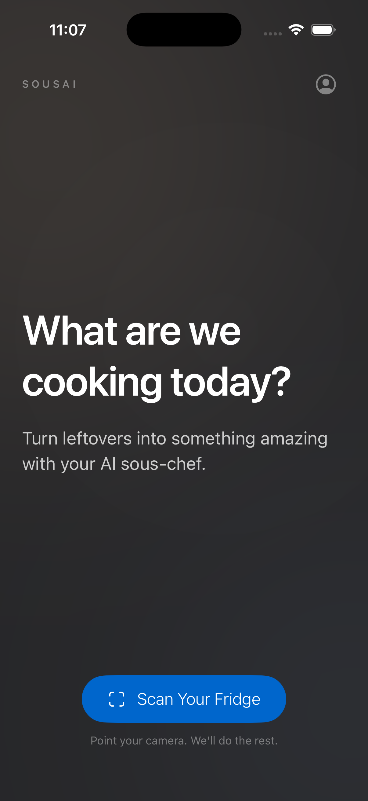
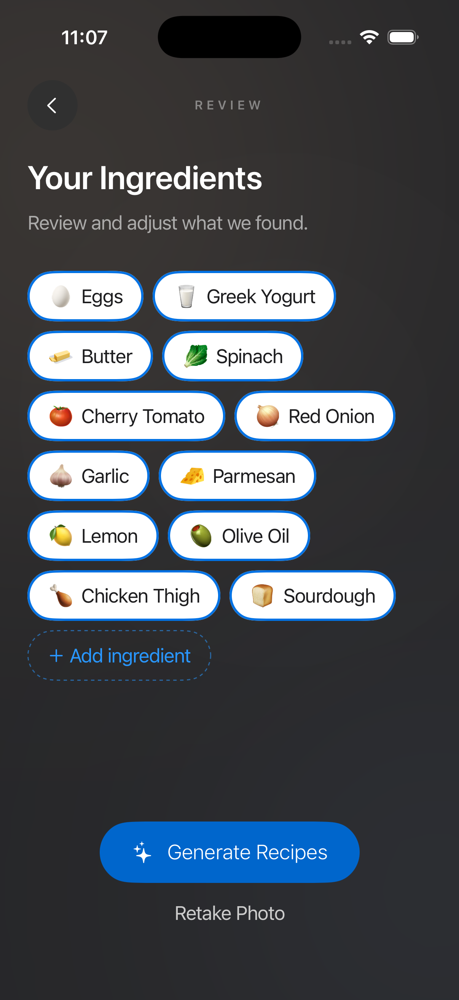
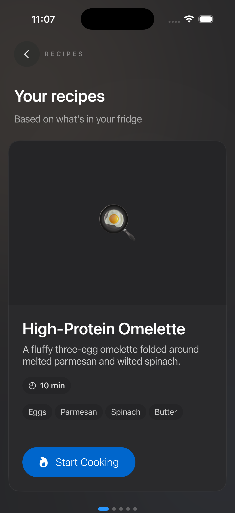
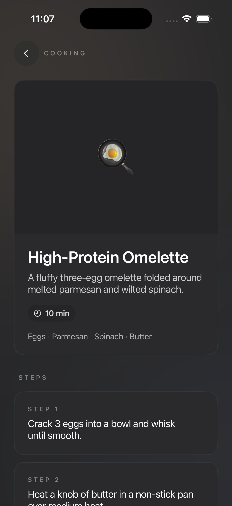

# SousAI

## Description

Ever opened a full fridge and still had no idea what to make? Most recipe apps make you pick a dish first, then send you to the store for the three things you don't have. SousAI works the other way around: take one photo of your fridge, and it tells you what you can cook right now — then walks you through cooking it, step by step, and helps you out when something goes wrong. Built with SwiftUI for the interface, AVFoundation for the camera, and OpenAI's GPT-4o-mini and DALL·E 3 for the intelligence, with no third-party dependencies.

## Features

### Start with one photo

Point your camera at your open fridge and tap the shutter. There's nothing to set up, no pantry to fill in beforehand, and no account to make. If you'd rather use a photo you already took, you can pick one from your library instead.



### Review what it found

SousAI reads the photo and lists the ingredients it can see, each with its own emoji and a confidence score. The list is yours to correct before anything gets generated — tap an item to cross it off if it got something wrong, or add the garlic it missed at the back of the shelf. Nothing is cooked up from a list you haven't approved.



### Get recipes you can actually make

From your approved ingredients, SousAI generates four recipes — deliberately different from one another in technique and cuisine, rather than four versions of the same dish. Each one comes with a cook time, the ingredients it uses, and a photo of the finished dish. Swipe through them, and if none of them appeal, ask for four more.



### Cook with a guide

Pick a recipe and the steps appear one at a time, so you're not scrolling through a wall of text with wet hands. Each step expands as you get to it, keeping the one thing you're doing right now front and centre.



### Ask for help mid-cook

This is the part most recipe apps skip. If something isn't going to plan, type it on the step you're standing on — "it's sticking to the pan", "way too salty", "this looks nothing like the photo" — and you'll get a short, specific fix in a couple of sentences. If the dish genuinely needs to change course, the remaining steps and ingredients rewrite themselves and the screen updates in place.

## How it's built

SousAI is a native iOS app: 8 screens, around 7,150 lines of Swift, and no third-party libraries — no networking framework, no image loader, no UI kit. Everything runs on Swift, SwiftUI, and Apple's own frameworks.

A few decisions worth calling out:

- **Recipes appear before their photos do.** Generating a dish image takes 10–20 seconds, so waiting for all four would mean staring at a spinner. Instead the recipe text arrives first and the cards render immediately with a placeholder, while four image requests run concurrently and fade into their cards as they finish.

- **The AI's output is treated as a first draft.** A model reading a cluttered fridge will occasionally miss a jar or invent a lemon, so the detected ingredient list is editable before it's used for anything. It's a product decision as much as a technical one.

- **Every model response is constrained to JSON** and decodes straight into Swift types, so there's no fragile string parsing anywhere. Temperature is tuned per call — low for identifying ingredients, where the answer should be boring and repeatable, higher for generating recipes, where variety is the point.

- **Photos are shrunk before they're uploaded.** A full-resolution iPhone capture is several megabytes, and the vision model doesn't use that detail, so images are downscaled and re-encoded on device first. Requests go out at a few hundred kilobytes instead.

- **The camera is a proper state machine.** Permission, hardware availability, configuration, and failure are all explicit states, and the session runs on its own queue so starting the camera never stutters the animation on screen.

- **42 automated tests** cover the parts most likely to break quietly: reading AI responses, handling denied camera permissions, and preparing photos for upload.

The interface follows a written design specification (`DESIGN.md`) rather than being improvised screen by screen, with every colour, type size, and spacing value resolving through a shared set of design tokens.

For a full technical breakdown — architecture diagrams, the concurrency model, and how the tests are wired — see [ARCHITECTURE.md](ARCHITECTURE.md).

## Getting started

Note: Xcode 15 or later and an OpenAI API key are required. The app targets iOS 17 and runs on both iPhone and iPad.

Clone the repository:

```bash
git clone <repository-url>
cd SousAI
```

Add your OpenAI API key. A build phase copies this into the app bundle, so you only ever edit one file:

```bash
cp .env.example .env
```

Then open `.env` and set your key:

```bash
OPENAI_API_KEY=sk-...
```

Open the project:

```bash
open SousAI.xcodeproj
```

Build and run on a physical device to use the camera. The Simulator works for everything else — pick a fridge photo from the photo library instead of taking one.

Both `.env` and its bundled copy are gitignored. If the key is missing or still the placeholder, debug builds fail immediately on launch rather than surfacing an opaque error three screens later.

## Running tests

To run the test suite:

```bash
xcodebuild -project SousAI.xcodeproj -scheme SousAI \
  -destination 'platform=iOS Simulator,name=iPhone 17 Pro' test
```

Tests can also be run from Xcode with `Cmd+U`.
